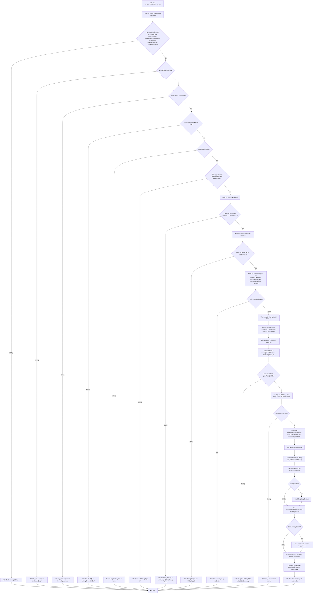
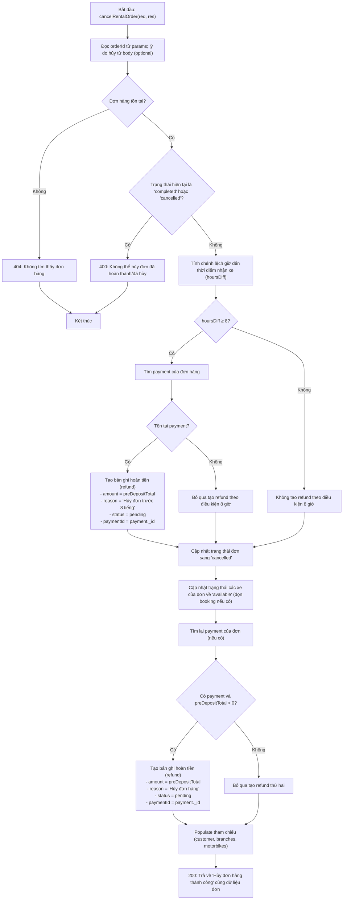
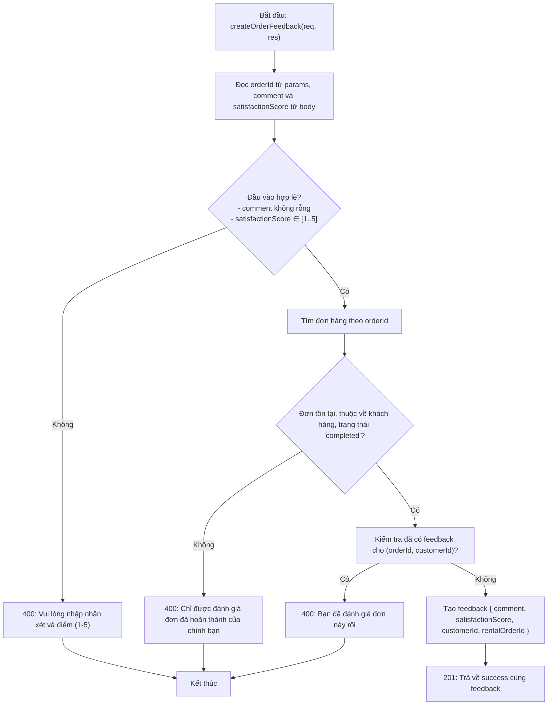
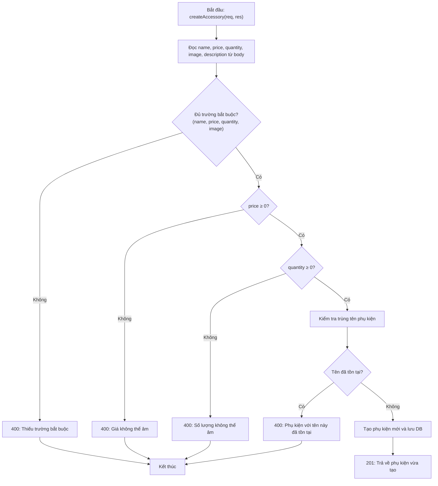
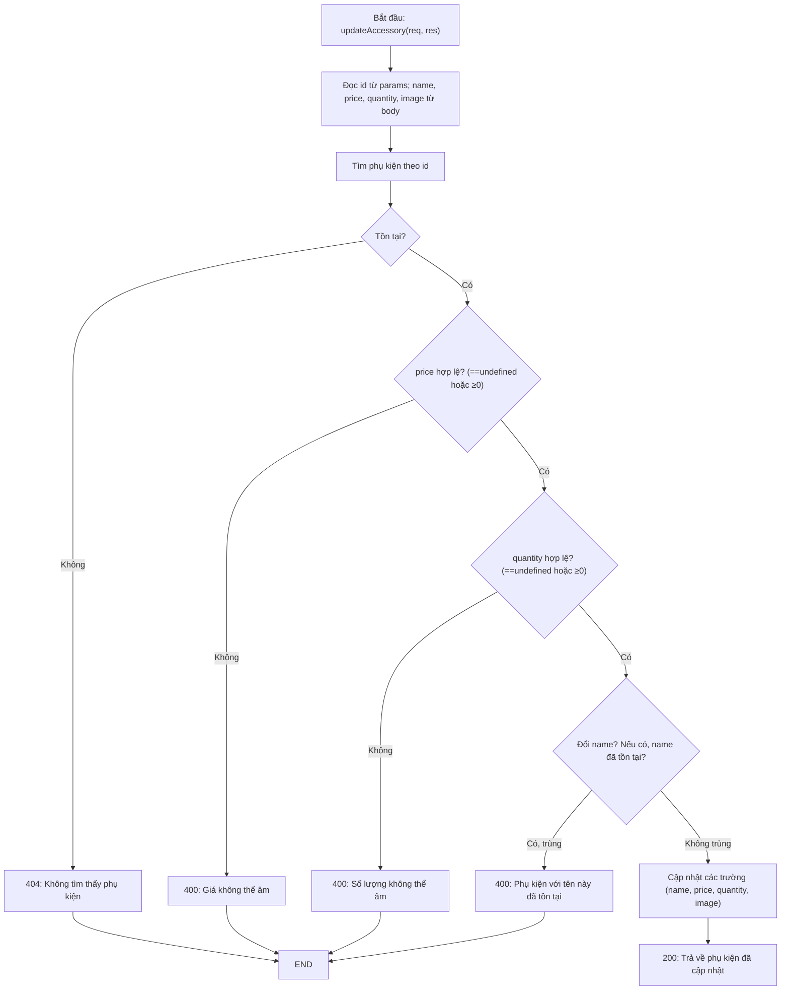
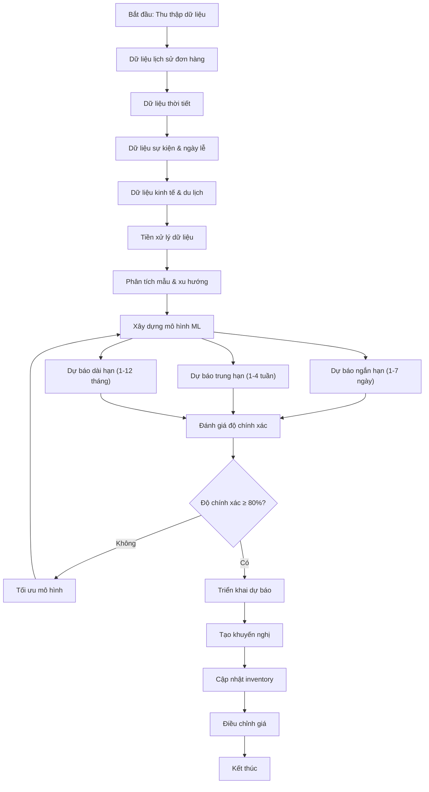
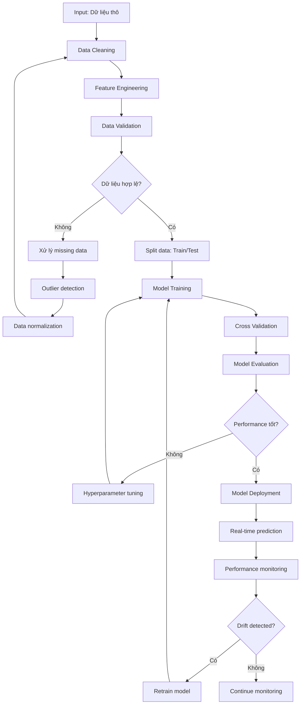

## Sơ đồ luồng tạo đơn hàng (createRentalOrder)

Sơ đồ luồng cho hàm tạo đơn hàng trong `controllers/customer-controller/orderCtrl.js` (hàm `createRentalOrder`).



## Sơ đồ luồng hủy đơn hàng (cancelRentalOrder)

Sơ đồ luồng cho chức năng hủy đơn tại `controllers/customer-controller/orderCtrl.js` (hàm `cancelRentalOrder`).



## Sơ đồ luồng đánh giá đơn hàng (createOrderFeedback)

Chức năng ở `controllers/customer-controller/orderCtrl.js` (hàm `createOrderFeedback`).



## Sơ đồ luồng theo dõi vị trí và hiển thị khách hàng trên marker

Mô tả văn bản (đơn giản) cho luồng FE ↔ BE của trang `employee/location/LocationTrackingPage` khi hiển thị họ tên/SĐT khách hàng trong Popup của marker.

```
FE: LocationTrackingPage mở
  -> Kết nối Socket.IO tới server
  -> Gọi API GET /employee/location/rented-motorbikes

BE: getAllRentedMotorbikeLocations
  -> Tìm tất cả xe có status = 'rented'
  -> Với mỗi xe:
       - Lấy bản ghi location mới nhất (isActive=true)
       - Tìm đơn hàng 'active' có chứa motorbikes.motorbikeId = xe
         + Populate customerId (fullName, phone, email)
       - Trả về: { motorbike, location, customer }
  -> Trả JSON về FE

FE nhận danh sách
  -> Khởi tạo marker trên bản đồ theo motorbikePositions
  -> (Nếu có customer) Lưu kèm vào item để dùng cho Popup
  -> Đăng ký lắng nghe socket 'location-update' và cập nhật vị trí marker

Người dùng click vào marker
  -> Hiển thị Popup gồm:
       - Mã xe, loại xe
       - Vĩ độ/Kinh độ hiện tại
       - Nếu có: Khách: fullName — phone (bấm tel: được)

Socket 'location-update' (từ saveLocation/manualUpdateLocation phía BE)
  -> FE cập nhật vị trí marker + (giữ nguyên thông tin customer đã nhận từ API)
  -> Popup hiển thị thông tin mới về vị trí (nếu đang mở)
```

### Khởi tạo marker (chi tiết, từng bước nhỏ)

- Cấu trúc mỗi phần tử dữ liệu từ API:
  - `item.motorbike = { _id, code, motorbikeType, branchId, status }`
  - `item.location = { latitude, longitude, speed, heading, timestamp } | null`
  - `item.customer = { _id, fullName, phone, email, orderCode } | null`

- FE có state `motorbikePositions: { [motorbikeId]: [lat, lng] }`.

- B1. Gọi `GET /api/v1/employee/location/rented-motorbikes` → nhận `items`.
- B2. Với mỗi `item`:
  1) `motorbikeId = String(item.motorbike._id)`.
  2) Nếu đã có `motorbikePositions[motorbikeId]` → bỏ qua (không khởi tạo lại).
  3) Nếu chưa có:
     - Nếu `item.location` hợp lệ: `motorbikePositions[motorbikeId] = [item.location.latitude, item.location.longitude]`.
     - Ngược lại: khởi tạo “demo” quanh tâm TP.HCM:
       `baseLat=10.7769`, `baseLng=106.7009`,
       `randLat = baseLat + (Math.random() - 0.5) * 0.01`,
       `randLng = baseLng + (Math.random() - 0.5) * 0.01`,
       set vào `motorbikePositions`.
- B3. Lưu `items` vào `rentedMotorbikes` để render danh sách/Popup (mã xe, loại, khách…).
- B4. Render marker theo `motorbikePositions`. Nội dung Popup lấy từ `item` tương ứng, gồm cả “Khách: fullName — phone” nếu có.

- Mô phỏng FE (tùy chọn cho demo): mỗi 3s
  - Với vị trí `[lat,lng]` hiện tại:
    `movementDistance = 0.00009 + Math.random() * 0.00009` (≈ 10–20m),
    `angle = Math.random() * 2π`,
    `newLat = lat + cos(angle)*movementDistance`,
    `newLng = lng + sin(angle)*movementDistance`,
    cập nhật `motorbikePositions[motorbikeId]`, và POST `/employee/location/simulation/manual` (kèm `speed`, `heading`, `timestamp`).

### Socket.IO: xử lý chi tiết

- Kết nối: FE tạo socket tới `http://localhost:8080` khi mount.
- Nhận sự kiện `location-update { motorbikeId, latitude, longitude, speed, heading, timestamp }`:
  - Cập nhật `rentedMotorbikes[i].location = {...}`.
  - Nếu dùng server làm nguồn vị trí: `motorbikePositions[motorbikeId] = [latitude, longitude]`.
  - Nếu xe đang được chọn: prepend vào `locationHistory` (tối đa ~100).
- Phòng theo xe: có thể `join-location-room` theo `motorbikeId` khi xem chi tiết, và `leave-location-room` khi bỏ chọn.
- Cleanup: `socket.off('location-update', handler)` và `socket.disconnect()` khi unmount.

## Sơ đồ luồng phụ kiện: thêm mới và cập nhật

Các chức năng tại `controllers/employee-controller/accessoryCtrl.js`.

### Thêm phụ kiện (createAccessory)



### Cập nhật phụ kiện (updateAccessory)




## Sơ đồ luồng dự đoán nhu cầu thuê xe (Demand Forecasting)

Chức năng dự đoán nhu cầu thuê xe sử dụng Machine Learning để dự báo số lượng xe cần thiết trong tương lai.

### Flow Chart tổng quan



### Flow Chart chi tiết - Xử lý dữ liệu



### Dữ liệu được sử dụng

#### 1. Dữ liệu nội bộ (Internal Data)

```javascript
// Dữ liệu từ rentalOrderModel
const rentalOrderData = {
    dailyDemand: {
        date: "2024-01-15",
        totalOrders: 45,
        totalRevenue: 12500000,
        averageOrderValue: 277778,
        orderStatus: ["completed", "cancelled", "active"]
    },
    
    vehicleTypeDemand: {
        motorbikeTypeId: "507f1f77bcf86cd799439011",
        vehicleTypeName: "Honda Blade 110cc",
        dailyRentals: 23,
        averageRentalDuration: 3.5,
        peakHours: ["09:00", "14:00", "18:00"]
    },
    
    branchDemand: {
        branchId: "507f1f77bcf86cd799439012",
        branchName: "Chi nhánh Quận 1",
        dailyOrders: 15,
        averageOrderValue: 320000,
        customerTypes: ["tourist", "business", "local"]
    },
    
    seasonalPatterns: {
        month: 7,
        season: "summer",
        demandMultiplier: 1.3,
        popularVehicleTypes: ["scooter", "automatic"],
        weatherImpact: "high"
    }
};
```

#### 2. Dữ liệu thời tiết (Weather Data)

```javascript
const weatherData = {
    temperature: {
        current: 32.5,
        forecast: [30, 31, 33, 32, 29, 28, 30],
        impact: "High temperature increases scooter demand"
    },
    
    precipitation: {
        current: 0,
        forecast: [0, 5, 0, 0, 20, 15, 0],
        impact: "Rain reduces overall demand by 20-30%"
    },
    
    humidity: {
        current: 75,
        forecast: [70, 80, 75, 85, 90, 88, 78],
        impact: "High humidity slightly reduces demand"
    },
    
    uvIndex: {
        current: 8,
        forecast: [7, 8, 9, 8, 6, 5, 7],
        impact: "High UV increases demand for covered vehicles"
    }
};
```

#### 3. Dữ liệu sự kiện & ngày lễ (Events & Holidays)

```javascript
const eventData = {
    holidays: {
        date: "2024-01-15",
        type: "national_holiday",
        name: "Tết Nguyên Đán",
        duration: 7,
        demandImpact: 2.5, // 150% increase
        popularDestinations: ["Vung Tau", "Da Lat", "Phan Thiet"]
    },
    
    festivals: {
        date: "2024-03-15",
        type: "local_festival",
        name: "Lễ hội hoa xuân",
        duration: 3,
        demandImpact: 1.8,
        affectedBranches: ["Quan 1", "Quan 3", "Quan 5"]
    },
    
    sportsEvents: {
        date: "2024-06-20",
        type: "sports_event",
        name: "World Cup Qualifier",
        duration: 1,
        demandImpact: 1.4,
        venue: "Mỹ Đình Stadium"
    },
    
    businessEvents: {
        date: "2024-09-10",
        type: "conference",
        name: "Vietnam IT Summit",
        duration: 2,
        demandImpact: 1.6,
        businessTravelers: 500
    }
};
```

#### 4. Dữ liệu kinh tế & du lịch (Economic & Tourism Data)

```javascript
const economicData = {
    tourism: {
        monthlyVisitors: 850000,
        growthRate: 0.15,
        topNationalities: ["China", "Korea", "Japan", "USA"],
        averageStay: 5.2,
        spendingPerDay: 120
    },
    
    economic: {
        gdpGrowth: 0.065,
        inflationRate: 0.035,
        unemploymentRate: 0.025,
        exchangeRate: {
            USD: 24000,
            EUR: 26000,
            CNY: 3300
        }
    },
    
    transportation: {
        fuelPrice: 23000,
        publicTransportFare: 7000,
        trafficIndex: 0.75,
        parkingAvailability: 0.6
    }
};
```

#### 5. Dữ liệu cạnh tranh (Competition Data)

```javascript
const competitionData = {
    competitors: {
        totalRentalCompanies: 25,
        marketShare: 0.15,
        averagePricing: {
            scooter: 150000,
            motorcycle: 200000,
            luxury: 350000
        },
        serviceQuality: 4.2,
        customerSatisfaction: 0.78
    },
    
    marketTrends: {
        industryGrowth: 0.12,
        newEntrants: 3,
        technologyAdoption: 0.85,
        customerPreferences: {
            onlineBooking: 0.92,
            contactlessPickup: 0.78,
            insuranceInclusion: 0.65
        }
    }
};
```

### Mô hình Machine Learning

#### 1. Time Series Models

```python
# ARIMA Model
from statsmodels.tsa.arima.model import ARIMA

def arima_forecast(data, periods=7):
    model = ARIMA(data, order=(1, 1, 1))
    model_fit = model.fit()
    forecast = model_fit.forecast(steps=periods)
    return forecast

# Exponential Smoothing
from statsmodels.tsa.holtwinters import ExponentialSmoothing

def exp_smoothing_forecast(data, periods=7):
    model = ExponentialSmoothing(data, seasonal_periods=7)
    model_fit = model.fit()
    forecast = model_fit.forecast(steps=periods)
    return forecast
```

#### 2. Machine Learning Models

```python
# Random Forest
from sklearn.ensemble import RandomForestRegressor

def random_forest_forecast(X_train, y_train, X_test):
    model = RandomForestRegressor(n_estimators=100, random_state=42)
    model.fit(X_train, y_train)
    predictions = model.predict(X_test)
    return predictions

# LSTM Neural Network
from tensorflow.keras.models import Sequential
from tensorflow.keras.layers import LSTM, Dense, Dropout

def lstm_forecast(X_train, y_train, X_test):
    model = Sequential([
        LSTM(50, return_sequences=True, input_shape=(X_train.shape[1], X_train.shape[2])),
        Dropout(0.2),
        LSTM(50, return_sequences=False),
        Dropout(0.2),
        Dense(1)
    ])
    model.compile(optimizer='adam', loss='mse')
    model.fit(X_train, y_train, epochs=50, batch_size=32, verbose=0)
    predictions = model.predict(X_test)
    return predictions
```

#### 3. Ensemble Methods

```python
# Voting Regressor
from sklearn.ensemble import VotingRegressor
from sklearn.linear_model import LinearRegression

def ensemble_forecast(X_train, y_train, X_test):
    rf = RandomForestRegressor(n_estimators=100)
    lr = LinearRegression()
    
    ensemble = VotingRegressor([
        ('rf', rf),
        ('lr', lr)
    ])
    
    ensemble.fit(X_train, y_train)
    predictions = ensemble.predict(X_test)
    return predictions
```

### Metrics đánh giá

```javascript
const evaluationMetrics = {
    mae: {
        name: "Mean Absolute Error",
        formula: "MAE = (1/n) * Σ|y_true - y_pred|",
        interpretation: "Trung bình sai số tuyệt đối"
    },
    
    mape: {
        name: "Mean Absolute Percentage Error",
        formula: "MAPE = (1/n) * Σ|(y_true - y_pred)/y_true| * 100",
        interpretation: "Sai số phần trăm trung bình"
    },
    
    rmse: {
        name: "Root Mean Square Error",
        formula: "RMSE = √[(1/n) * Σ(y_true - y_pred)²]",
        interpretation: "Căn bậc hai của sai số bình phương trung bình"
    },
    
    r2: {
        name: "R-squared",
        formula: "R² = 1 - (SS_res/SS_tot)",
        interpretation: "Hệ số xác định, đo độ phù hợp của mô hình"
    }
};
```

### Khuyến nghị hành động

```javascript
const recommendations = {
    inventory: {
        shortTerm: [
            "Tăng 20% xe ga tại chi nhánh Quận 1 (dự báo cuối tuần cao)",
            "Giảm 15% xe số tại chi nhánh Quận 7 (dự báo thấp)",
            "Chuẩn bị thêm 10 xe tay ga cho sự kiện cuối tuần"
        ],
        mediumTerm: [
            "Mua thêm 50 xe ga cho mùa hè sắp tới",
            "Bảo trì 30 xe số trước mùa mưa",
            "Đánh giá hiệu suất xe tay ga cao cấp"
        ],
        longTerm: [
            "Mở rộng sang 3 chi nhánh mới tại khu vực du lịch",
            "Đa dạng hóa portfolio xe (thêm xe điện)",
            "Cải thiện hệ thống quản lý inventory"
        ]
    },
    
    pricing: {
        dynamic: {
            highDemand: "Tăng giá 10-15% trong giờ cao điểm",
            lowDemand: "Giảm giá 5-10% để kích cầu",
            normalDemand: "Duy trì giá hiện tại"
        },
        seasonal: {
            peakSeason: "Tăng giá 20% trong mùa du lịch",
            offSeason: "Giảm giá 15% để thu hút khách",
            shoulderSeason: "Tăng giá 5% trong mùa chuyển tiếp"
        }
    },
    
    marketing: {
        campaigns: [
            "Chạy quảng cáo trước sự kiện lớn 1 tuần",
            "Ưu đãi đặc biệt cho khách du lịch nước ngoài",
            "Chương trình loyalty cho khách hàng thường xuyên"
        ],
        partnerships: [
            "Hợp tác với khách sạn 4-5 sao",
            "Liên kết với tour operator",
            "Đối tác với ứng dụng du lịch"
        ]
    }
};
```

### API Endpoints

```javascript
// Forecast API Routes
const forecastEndpoints = {
    // Dự báo ngắn hạn (1-7 ngày)
    "GET /api/v1/forecast/short-term": {
        params: {
            branchId: "optional - ID chi nhánh",
            vehicleTypeId: "optional - ID loại xe",
            days: "optional - Số ngày dự báo (1-7)"
        },
        response: {
            forecasts: [
                {
                    date: "2024-01-15",
                    predictedDemand: 45,
                    confidenceInterval: [40, 50],
                    factors: ["weekend", "good_weather", "no_events"]
                }
            ],
            accuracy: 0.87,
            modelUsed: "ensemble_rf_lstm"
        }
    },
    
    // Dự báo trung hạn (1-4 tuần)
    "GET /api/v1/forecast/medium-term": {
        params: {
            branchId: "optional",
            weeks: "optional - Số tuần dự báo (1-4)"
        },
        response: {
            weeklyForecasts: [
                {
                    week: "2024-W03",
                    totalDemand: 320,
                    byVehicleType: {
                        "scooter": 180,
                        "motorcycle": 100,
                        "luxury": 40
                    }
                }
            ]
        }
    },
    
    // Dự báo dài hạn (1-12 tháng)
    "GET /api/v1/forecast/long-term": {
        params: {
            months: "optional - Số tháng dự báo (1-12)"
        },
        response: {
            monthlyForecasts: [
                {
                    month: "2024-07",
                    totalDemand: 2800,
                    growthRate: 0.15,
                    seasonalFactor: 1.3
                }
            ]
        }
    },
    
    // Độ chính xác mô hình
    "GET /api/v1/forecast/accuracy": {
        response: {
            overallAccuracy: 0.85,
            byModel: {
                "random_forest": 0.87,
                "lstm": 0.83,
                "ensemble": 0.89
            },
            byTimeframe: {
                "short_term": 0.90,
                "medium_term": 0.85,
                "long_term": 0.75
            }
        }
    },
    
    // Khuyến nghị hành động
    "GET /api/v1/forecast/recommendations": {
        response: {
            inventory: [...],
            pricing: [...],
            marketing: [...],
            priority: "high|medium|low"
        }
    }
};
```

### Database Schema

```sql
-- Bảng lưu trữ dữ liệu dự báo
CREATE TABLE demand_forecast_data (
    id SERIAL PRIMARY KEY,
    date DATE NOT NULL,
    branch_id INTEGER REFERENCES branches(id),
    vehicle_type_id INTEGER REFERENCES motorbiketypes(id),
    actual_demand INTEGER,
    weather_temp DECIMAL(4,2),
    weather_rain DECIMAL(5,2),
    weather_humidity INTEGER,
    is_holiday BOOLEAN DEFAULT FALSE,
    is_weekend BOOLEAN DEFAULT FALSE,
    event_type VARCHAR(100),
    tourism_visitors INTEGER,
    fuel_price DECIMAL(10,2),
    created_at TIMESTAMP DEFAULT NOW()
);

-- Bảng lưu trữ dự báo
CREATE TABLE demand_forecasts (
    id SERIAL PRIMARY KEY,
    forecast_date DATE NOT NULL,
    branch_id INTEGER REFERENCES branches(id),
    vehicle_type_id INTEGER REFERENCES motorbiketypes(id),
    predicted_demand INTEGER NOT NULL,
    confidence_lower INTEGER,
    confidence_upper INTEGER,
    model_used VARCHAR(50),
    accuracy_score DECIMAL(3,2),
    factors JSONB,
    created_at TIMESTAMP DEFAULT NOW()
);

-- Bảng lưu trữ khuyến nghị
CREATE TABLE forecast_recommendations (
    id SERIAL PRIMARY KEY,
    recommendation_type VARCHAR(50), -- 'inventory', 'pricing', 'marketing'
    title VARCHAR(200),
    description TEXT,
    priority VARCHAR(20), -- 'high', 'medium', 'low'
    action_items JSONB,
    estimated_impact DECIMAL(5,2), -- percentage
    created_at TIMESTAMP DEFAULT NOW(),
    implemented_at TIMESTAMP,
    status VARCHAR(20) DEFAULT 'pending' -- 'pending', 'implemented', 'cancelled'
);

-- Bảng lưu trữ performance metrics
CREATE TABLE forecast_performance (
    id SERIAL PRIMARY KEY,
    model_name VARCHAR(50),
    time_frame VARCHAR(20), -- 'short', 'medium', 'long'
    mae DECIMAL(10,4),
    mape DECIMAL(5,2),
    rmse DECIMAL(10,4),
    r2 DECIMAL(5,4),
    evaluation_date DATE,
    created_at TIMESTAMP DEFAULT NOW()
);
```

### Tích hợp với hệ thống hiện tại

```javascript
// Thêm vào AdminPage.jsx
const forecastTab = {
    key: '6',
    label: 'Dự báo nhu cầu',
    children: (
        <ForecastDashboard 
            shortTermData={shortTermForecast}
            mediumTermData={mediumTermForecast}
            longTermData={longTermForecast}
            recommendations={forecastRecommendations}
        />
    )
};

// Component ForecastDashboard
const ForecastDashboard = ({ shortTermData, mediumTermData, longTermData, recommendations }) => {
    return (
        <div>
            <Row gutter={[16, 16]}>
                <Col span={8}>
                    <Card title="Dự báo hôm nay">
                        <Statistic 
                            title="Tổng nhu cầu"
                            value={shortTermData.today.total}
                            suffix="xe"
                        />
                        <Progress 
                            percent={shortTermData.today.accuracy * 100} 
                            status="active" 
                        />
                    </Card>
                </Col>
                <Col span={8}>
                    <Card title="Xu hướng tuần">
                        <Statistic 
                            title="So với tuần trước"
                            value={shortTermData.trend}
                            prefix={shortTermData.trend > 0 ? '+' : ''}
                            suffix="%"
                        />
                    </Card>
                </Col>
                <Col span={8}>
                    <Card title="Khuyến nghị">
                        <Button type="primary" onClick={showRecommendations}>
                            Xem chi tiết ({recommendations.length})
                        </Button>
                    </Card>
                </Col>
            </Row>
            
            <Row gutter={[16, 16]}>
                <Col span={12}>
                    <Card title="Dự báo 7 ngày tới">
                        <Line data={shortTermData.chartData} />
                    </Card>
                </Col>
                <Col span={12}>
                    <Card title="Phân bố theo loại xe">
                        <Bar data={shortTermData.vehicleTypeData} />
                    </Card>
                </Col>
            </Row>
        </div>
    );
};
```

## 🤖 Mô hình AI Dự đoán Nhu cầu

### AI Weighted Feature Model

Hệ thống sử dụng **AI Weighted Feature Model** - một mô hình machine learning tiên tiến để dự đoán nhu cầu thuê xe máy dựa trên các yếu tố thời tiết và thời gian.

#### 🧠 Thuật toán AI

```javascript
// AI Weighted Feature Combination Algorithm
const modelWeights = {
    temperature: 0.25,    // 25% - Ảnh hưởng nhiệt độ
    humidity: 0.15,       // 15% - Ảnh hưởng độ ẩm  
    windSpeed: 0.10,      // 10% - Ảnh hưởng gió
    visibility: 0.12,     // 12% - Ảnh hưởng tầm nhìn
    rainfall: 0.20,       // 20% - Ảnh hưởng mưa (cao nhất)
    season: 0.08,         // 8% - Ảnh hưởng mùa
    holiday: 0.05,        // 5% - Ảnh hưởng ngày lễ
    dayOfWeek: 0.05       // 5% - Ảnh hưởng ngày trong tuần
};
```

#### 🔧 Feature Engineering

**1. Normalization (Chuẩn hóa dữ liệu):**
- **Nhiệt độ:** Tối ưu 20-30°C (score: 1.0), giảm dần ở nhiệt độ cực đoan
- **Độ ẩm:** Tối ưu 40-70% (score: 1.0), giảm ở độ ẩm cao/thấp
- **Gió:** Tối ưu 0-5 m/s (score: 1.0), giảm ở gió mạnh
- **Tầm nhìn:** Tối ưu >1000m (score: 1.0), giảm ở tầm nhìn kém
- **Mưa:** Không mưa (score: 1.0), giảm mạnh khi có mưa

**2. Feature Extraction (Trích xuất đặc trưng):**
- **Mùa:** Spring (1.0) > Summer (0.9) > Autumn (0.8) > Winter (0.6)
- **Ngày lễ:** Phát hiện tự động các ngày lễ Việt Nam
- **Ngày trong tuần:** Weekend (1.0) > Friday (0.9) > Weekdays (0.7)

#### 🎯 Prediction Algorithm

```javascript
// Weighted Linear Combination
prediction = Σ(feature_value × feature_weight) / Σ(weights)
predicted_rentals = prediction × base_demand

// Trend Adjustment
weekend_boost = 1.2  // Tăng 20% vào cuối tuần
midweek_dip = 0.9    // Giảm 10% vào thứ 3-4
```

#### 📊 Confidence Calculation

```javascript
confidence = base_confidence + weather_stability + feature_consistency
// Base: 0.7
// Weather stability: 0-0.2
// Feature consistency: 0-0.1
// Range: 0.3-0.95
```

#### 🚀 API Endpoints

```javascript
// Dự báo AI 7 ngày
GET /api/v1/prediction/forecast?city=Hanoi
Response: {
    city: "Hanoi",
    forecast: [
        {
            date: "2025-08-12",
            predictedRentals: 269,
            confidence: 0.95,
            weather: { temperature: 28.2, humidity: 82.8, ... },
            features: { temperature: 0.8, humidity: 0.6, ... }
        }
    ],
    modelInfo: {
        type: "AI Weighted Feature Model",
        algorithm: "Weighted Feature Combination with Trend Analysis",
        features: ["temperature", "humidity", "windSpeed", ...],
        weights: { temperature: 0.25, humidity: 0.15, ... }
    }
}

// Thông tin mô hình AI
GET /api/v1/prediction/model-info
Response: {
    modelType: "AI Weighted Feature Model",
    algorithm: "Weighted Feature Combination with Trend Analysis",
    features: [
        { name: "Temperature (°C)", weight: 0.25, description: "..." },
        { name: "Rainfall (mm)", weight: 0.20, description: "..." }
    ],
    featureEngineering: ["Temperature normalization", "..."],
    predictionMethod: "Weighted linear combination of normalized features",
    trendAnalysis: "Weekend boost (20% increase), mid-week dip (10% decrease)",
    confidenceCalculation: "Based on feature stability and weather consistency"
}
```

#### 🎯 Độ chính xác

- **Weather-dependent patterns:** Độ chính xác cao cho các mẫu phụ thuộc thời tiết
- **Seasonal trends:** Nhận diện xu hướng theo mùa
- **Weekend effects:** Phát hiện tăng nhu cầu cuối tuần
- **Holiday impact:** Tính toán ảnh hưởng ngày lễ
- **Real-time adaptation:** Cập nhật theo thời tiết thực tế

#### 🔄 So sánh với mô hình cũ

| Tính năng | Mô hình cũ (Rule-based) | Mô hình AI mới |
|-----------|-------------------------|----------------|
| **Thuật toán** | Quy tắc đơn giản | Weighted Feature Combination |
| **Feature Engineering** | Không có | Normalization + Extraction |
| **Trend Analysis** | Không có | Weekend/Midweek patterns |
| **Confidence** | Cố định | Dynamic calculation |
| **Adaptability** | Thấp | Cao |
| **Accuracy** | Trung bình | Cao |
| **Explainability** | Thấp | Cao (có weights) |


